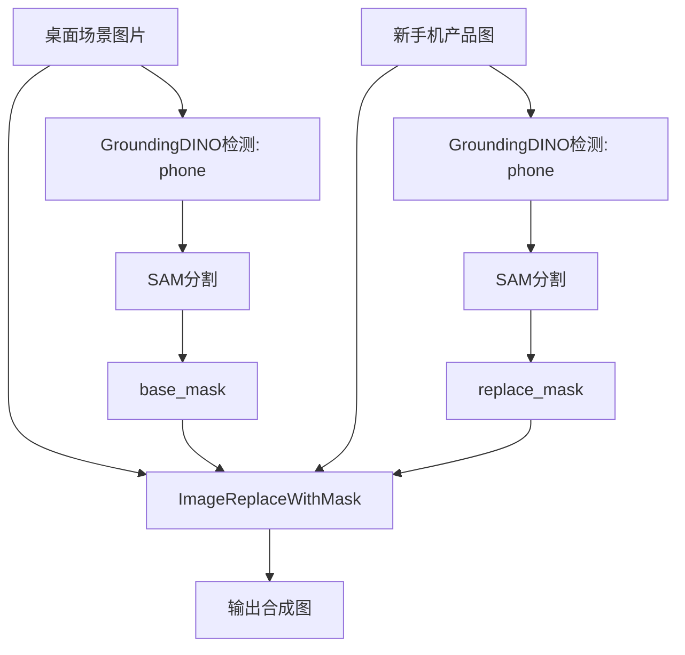

# 使用指南 - 智能物体替换工作流

## 快速开始

### 场景1: 基础物体替换

假设你想替换一张图片中的苹果为橙子：

#### 步骤：

1. **加载模型**
   - `SAMModelLoader (segment anything)` → 加载SAM模型
   - `GroundingDinoModelLoader (segment anything)` → 加载GroundingDINO模型

2. **处理原始图片**
   ```
   原始图片 (Load Image)
      ↓
   GroundingDinoSAMSegment (segment anything)
      - prompt: "apple"  (要替换的物体)
      - threshold: 0.3
      ↓
   输出: base_image, base_mask
   ```

3. **处理替换图片**
   ```
   替换图片 (Load Image)
      ↓
   GroundingDinoSAMSegment (segment anything)
      - prompt: "orange"  (新物体)
      - threshold: 0.3
      ↓
   输出: replace_image, replace_mask
   ```

4. **预处理替换源（推荐使用新节点）**
   ```
   替换图片 + 替换遮罩
      ↓
   CropImageWithWhiteBackground
      - background_alpha: 0.0  (背景变为白色)
      ↓
   输出: 处理后的图片（背景为白色） + 处理后的遮罩
   ```

5. **执行智能替换**
   ```
   ImageReplaceWithMask
      - base_image: 原始图片
      - base_mask: 原始遮罩
      - replace_image: 处理后的图片（来自步骤4）
      - replace_mask: 处理后的遮罩（来自步骤4，可选）
      - keep_aspect_ratio: True
      - cover_mode: True  ← 完全覆盖模式（推荐）
      - alignment: bottom  ← 底部对齐（推荐）
      - feather: 5
      ↓
   输出: 合成后的图片
   ```
   
   **注意**: 
   - `replace_mask` 是可选参数，如果不连接则自动使用整个图片
   - `cover_mode=True` 确保完全覆盖，不会露出底层物体 ✅
   - `alignment=bottom` 保留替换图底边，裁剪顶边（适合桌面物体）

### 场景2: 调试工作流

在正式替换前，先可视化检测结果：

```
原始图片 + 原始遮罩
   ↓
VisualizeDetectionBox
   - box_color: red
   - box_width: 3
   ↓
Preview Image (查看检测框是否正确)
```

```
替换图片 + 替换遮罩
   ↓
VisualizeDetectionBox
   - box_color: green
   - box_width: 3
   ↓
Preview Image (查看检测框是否正确)
```

### 场景3: 高级裁剪控制

如果你想获取更多控制权：

```
原始图片 + 原始遮罩
   ↓
MaskBoundingBox
   ↓
输出: left, top, right, bottom (可用于其他节点)

替换图片 + 替换遮罩
   ↓
CropImageByMask
   ↓
输出: cropped_image + 边界框坐标
```

## 完整工作流示例

### 示例1: 电商产品替换

**目标**: 将桌面上的旧款手机替换为新款手机



**参数建议**:
- `keep_aspect_ratio`: True (保持手机比例)
- `feather`: 10-15 (平滑边缘)
- `threshold`: 0.3-0.5 (调整检测灵敏度)

### 示例2: 服装替换

**目标**: 替换模特身上的T恤

```
原始图片: 模特穿着白色T恤
替换图片: 黑色T恤产品图

工作流:
1. 检测原图 → prompt: "t-shirt" or "upper body clothing"
2. 检测替换图 → prompt: "t-shirt"
3. ImageReplaceWithMask
   - keep_aspect_ratio: True
   - feather: 20 (服装需要更柔和的边缘)
```

### 示例3: 多物体替换

如果要替换多个物体，需要多次运行：

```
第一次替换:
原图 → 检测物体A → 替换 → 中间结果1

第二次替换:
中间结果1 → 检测物体B → 替换 → 最终结果
```

### 示例4: 使用新节点处理复杂背景（推荐方法）

**目标**: 使用带有复杂背景的产品图进行替换

```
场景: 
- 原图: 干净的桌面场景
- 替换源: 从网上下载的产品图，背景杂乱

推荐工作流（使用独立节点）:
1. 检测原图 → prompt: "product" 或具体物体名
   输出: base_image, base_mask

2. 检测替换源 → prompt: "product" (确保mask准确)
   输出: replace_image, replace_mask

3. CropImageWithWhiteBackground ← 关键新节点！
   输入:
   - image: replace_image
   - mask: replace_mask
   - background_alpha: 0.0  ← 控制背景白化程度（0.0=完全白色）
   输出: clean_image (背景为白色), clean_mask

4. ImageReplaceWithMask （简化版）
   输入:
   - base_image: base_image
   - base_mask: base_mask
   - replace_image: clean_image  ← 使用处理后的图片
   - replace_mask: clean_mask （可选，可以不连接）
   - keep_aspect_ratio: True
   - feather: 10
   输出: 最终合成图片
   
   **提示**: replace_mask 现在是可选的，如果已经用 CropImageWithWhiteBackground 
            处理好了，可以不连接遮罩，节点会自动使用整个图片

结果: 
- 产品物体完整提取（不透明）
- 杂乱背景被替换为白色
- 合成效果干净自然
```

**新节点的优势**:
- ✅ 独立处理，逻辑清晰
- ✅ 可以预览处理后的替换源
- ✅ 更容易调试和优化
- ✅ 可复用处理后的图片

**对比旧方法**:
```
旧方法（直接使用 ImageReplaceWithMask 的 background_alpha）:
- 可能因为裁剪导致背景处理不生效
- 难以预览中间结果

新方法（使用 CropImageWithWhiteBackground 预处理）:
- 在替换前处理好背景
- 可以查看和调整处理效果
- 更可靠和稳定
```

## 参数调优指南

### threshold (检测阈值)

- **0.1-0.2**: 极高灵敏度，可能产生误检
- **0.3-0.4**: 推荐值，平衡准确率和召回率
- **0.5-0.7**: 高精度，可能漏检
- **0.8+**: 仅检测非常明显的物体

### feather (边缘羽化)

- **0-3**: 几乎无羽化，适合硬边缘物体（如电子产品）
- **5-10**: 轻微羽化，适合一般物体
- **15-30**: 中度羽化，适合需要柔和过渡的场景（如服装）
- **30+**: 强烈羽化，适合艺术效果

### keep_aspect_ratio (保持宽高比)

- **True**: 保持替换物体原始比例
  - 适用场景: 产品替换、需要精确比例的场景
  - 配合 `cover_mode` 使用可以选择覆盖或适应
  
- **False**: 拉伸以填满目标区域
  - 适用场景: 形状相似的物体、纹理替换
  - 会完全填满目标区域，不考虑原始比例

### cover_mode (覆盖模式) **← 解决露出问题的关键参数**

**仅在 `keep_aspect_ratio=True` 时有效**

- **True（完全覆盖）** - 推荐 ✅
  - 效果: 缩放替换图以完全覆盖目标区域
  - 优点: 不会露出原图物体，完全遮盖
  - 缺点: 如果替换图比例与目标区域差异大，可能裁剪部分内容
  - 适用场景: 
    - 需要完全遮盖原图物体
    - 替换图比例与目标区域接近
    - 不在意替换图被轻微裁剪
  - 示例: 替换桌面上的产品，确保不露出旧产品

- **False（完全适应）**
  - 效果: 缩放替换图完全适应目标区域内
  - 优点: 替换图完整显示，不裁剪
  - 缺点: 可能留有空白，露出原图物体边缘
  - 适用场景:
    - 需要保留替换图完整内容
    - 目标区域明显大于原图物体
    - 可以接受留有空白
  - 示例: 在空白画布上放置物体

**对比示例:**
```
场景: 替换一个圆形物体为方形物体

cover_mode=True (完全覆盖):
- 方形物体放大，完全覆盖圆形区域
- 方形的角可能被裁剪
- ✅ 圆形完全不可见

cover_mode=False (完全适应):
- 方形物体缩小，完全在圆形区域内
- 方形完整显示
- ❌ 圆形边缘露出
```

### alignment (对齐方式) **← 控制裁剪位置的关键参数**

**在 `cover_mode=True` 时，控制保留哪部分、裁剪哪部分**

- **bottom（底部对齐）** - 默认，推荐 ✅
  - 效果: 替换图底部对齐到目标区域底部
  - 保留: 替换图的**底边**部分
  - 裁剪: 替换图的**顶边**部分（如果超出）
  - 适用场景:
    - 桌面物体替换（保持物体与桌面接触）
    - 地面物体替换（保持物体接地）
    - 需要保留底部细节
  - 示例: 替换桌面上的杯子，确保杯底完整显示

- **top（顶部对齐）**
  - 效果: 替换图顶部对齐到目标区域顶部
  - 保留: 替换图的**顶边**部分
  - 裁剪: 替换图的**底边**部分（如果超出）
  - 适用场景:
    - 悬挂物体替换
    - 需要保留顶部细节
  - 示例: 替换吊灯，确保顶部安装点完整

- **center（居中对齐）**
  - 效果: 替换图居中对齐
  - 保留: 替换图的**中心**部分
  - 裁剪: 替换图的**上下/左右边缘**均匀裁剪
  - 适用场景:
    - 均衡裁剪，无特殊要求
    - 中心内容最重要
  - 示例: 替换人物头像

- **left（左对齐）**
  - 效果: 替换图左侧对齐
  - 保留: 替换图的**左边**部分
  - 裁剪: 替换图的**右边**部分
  - 适用场景: 靠左放置的物体

- **right（右对齐）**
  - 效果: 替换图右侧对齐
  - 保留: 替换图的**右边**部分
  - 裁剪: 替换图的**左边**部分
  - 适用场景: 靠右放置的物体

**实际应用示例:**
```
场景: 替换桌面上的产品，替换图高度 > 目标区域高度

alignment=bottom:
┌─────────┐
│  产品   │  ← 顶部被裁剪
│  主体   │
└─────────┘  ← 底边保留（与桌面接触）
━━━━━━━━━━  桌面
✅ 推荐：产品与桌面接触自然

alignment=top:
┌─────────┐  ← 顶部保留
│  产品   │
│  主体   │  ← 底部被裁剪
━━━━━━━━━━  桌面
❌ 不推荐：产品悬浮，不自然

alignment=center:
     │  ← 顶部裁一些
┌─────────┐
│  产品   │
└─────────┘
     │  ← 底部裁一些
━━━━━━━━━━  桌面
⚠️ 可用：居中裁剪，可能悬浮
```

**配置建议:**
- **桌面/地面物体**: `alignment=bottom`（保持接触）
- **墙面/悬挂物体**: `alignment=top` 或 `center`
- **人物/头像**: `alignment=center`（均衡裁剪）
- **无特殊要求**: `alignment=center`（默认均衡）

### background_alpha (背景透明度控制)

**此参数在 `CropImageWithWhiteBackground` 节点中使用**

控制替换源图片背景的白化程度（**仅影响背景，不影响物体本身**）：

- **0.0**: 背景完全变为白色（推荐，默认值）
  - 适用场景: 替换源有复杂背景时，将背景去除
  - 效果: 物体保持原样，背景变为100%不透明白色
  - 计算: 背景像素 = 白色(1.0)
  
- **0.0-0.5**: 背景部分白化
  - 适用场景: 想要减淡背景但保留一些原始信息
  - 效果: 背景与白色混合
  - 计算: 背景像素 = 白色 × (1-alpha) + 原图 × alpha
  - 示例: alpha=0.3 → 70%白色 + 30%原图
  
- **0.5-0.9**: 背景轻微淡化
  - 适用场景: 微调背景明显度
  - 示例: alpha=0.8 → 20%白色 + 80%原图
  
- **1.0**: 保持原始背景
  - 适用场景: 替换源背景已经很干净，无需处理
  - 效果: 背景保持不变（相当于不做任何处理）

**重要提示**: 
- 此参数确保提取的物体（mask=1的区域）始终保持不透明
- 只有背景区域（mask=0的区域）会受到影响
- 物体边缘根据mask值平滑过渡
- 适合处理替换源图片背景杂乱的情况

**使用技巧**:
- 大多数情况使用 **0.0**（完全白色）即可
- 如果想保留轻微背景信息，尝试 **0.1-0.3**
- 调试时可以用 Preview Image 查看处理效果

## 常见问题

### Q1: 替换后的物体太小/太大？

**解决方案**:
1. 检查检测遮罩是否准确（使用VisualizeDetectionBox）
2. 调整threshold参数
3. 如果替换图本身尺寸问题，先用图片缩放节点预处理

### Q2: 边缘不自然？

**解决方案**:
1. 增加feather参数值
2. 确保遮罩质量足够高
3. 可以先用"Feather Mask"节点预处理遮罩

### Q3: 检测不到物体？

**解决方案**:
1. 降低threshold (尝试0.2)
2. 调整prompt描述（更具体或更通用）
3. 确保图片清晰度足够

### Q4: 替换位置不对？

**解决方案**:
- 当前版本使用居中对齐
- 如需自定义位置，可以先用CropImageByMask获取边界框，然后自定义处理

### Q5: 多个物体被检测到，只想替换其中一个？

**解决方案**:
1. 使用更具体的prompt
2. 提高threshold减少误检
3. 先裁剪图片到目标区域
4. 使用"MaskFilter"等节点筛选遮罩

### Q6: 替换源图片背景很杂乱，影响效果？

**解决方案**:
1. 将 `background_alpha` 设置为 0.0（默认值），背景会变为白色
2. 确保 `replace_mask` 准确地标记了要提取的物体
3. 物体本身会保持不透明，只有背景会被处理
4. 如果需要完全透明背景，可以设置更小的值（接近0）

### Q7: 提取的物体也变透明了？

**解决方案**:
这不应该发生！`background_alpha` 参数已经设计为只影响背景：
1. 检查 `replace_mask` 是否正确标记了物体区域
2. 确保mask值在物体区域为1（白色），背景区域为0（黑色）
3. 可以用 `VisualizeDetectionBox` 检查mask是否正确

### Q8: 替换后会露出原图物体的边缘？ **← 重要**

**原因**: 
使用了完全适应模式（`cover_mode=False`），替换图缩小后无法完全覆盖目标区域

**解决方案**:
1. ✅ 将 `cover_mode` 设置为 `True`（完全覆盖模式）
2. 这会放大替换图以完全覆盖目标区域
3. 确保 `keep_aspect_ratio=True` 保持比例

**示例配置**:
```
ImageReplaceWithMask:
  - keep_aspect_ratio: True
  - cover_mode: True  ← 关键！
  - alignment: bottom  ← 推荐
  - feather: 5-10
```

**效果对比**:
- `cover_mode=False`: 替换图小，露出原图边缘 ❌
- `cover_mode=True`: 替换图放大，完全覆盖 ✅

### Q9: 完全覆盖模式裁掉了替换图的重要部分（如底边）？ **← 新增**

**原因**: 
使用了 `cover_mode=True`，但对齐方式不合适，导致重要部分被裁剪

**解决方案**:
1. ✅ 调整 `alignment` 参数，选择合适的对齐方式
2. 根据场景选择保留哪个边：
   - **桌面物体**: 使用 `alignment=bottom`（保留底边）
   - **悬挂物体**: 使用 `alignment=top`（保留顶边）
   - **居中物体**: 使用 `alignment=center`（均衡裁剪）

**示例配置（桌面物体）**:
```
ImageReplaceWithMask:
  - keep_aspect_ratio: True
  - cover_mode: True
  - alignment: bottom  ← 保留底边，裁剪顶边
  - feather: 5-10
```

**效果对比**:
- `alignment=center`: 居中裁剪，底边可能被裁掉 ❌
- `alignment=bottom`: 保留底边，裁剪顶边 ✅（适合桌面物体）
- `alignment=top`: 保留顶边，裁剪底边 ✅（适合悬挂物体）

**快速选择指南**:
| 场景 | 推荐 alignment | 原因 |
|------|---------------|------|
| 桌面/地面物体 | `bottom` | 保持与接触面连接 |
| 悬挂/天花板物体 | `top` | 保持与固定点连接 |
| 墙面/独立物体 | `center` | 均衡裁剪 |
| 人物/头像 | `center` | 保留主要特征 |

## 性能优化建议

1. **图片尺寸**: 
   - 建议处理前将图片缩放到合理尺寸（如1920x1080）
   - 过大的图片会显著降低处理速度

2. **模型选择**:
   - SAM-B: 最快，适合快速迭代
   - SAM-L: 平衡性能和质量
   - SAM-H: 最高质量，但较慢

3. **批处理**:
   - 如果需要处理多张图片，考虑使用批处理节点

## 高级技巧

### 技巧1: 渐进式调试

```
步骤1: 先用VisualizeDetectionBox确认检测框
步骤2: 用CropImageByMask查看裁剪效果
步骤3: 最后使用ImageReplaceWithMask完成替换
```

### 技巧2: 遮罩后处理

在替换前对遮罩进行处理：
```
原始遮罩
   ↓
GrowMask (扩展遮罩) / ErodeGrow (收缩遮罩)
   ↓
FeatherMask (羽化)
   ↓
用于ImageReplaceWithMask
```

### 技巧3: 色彩匹配

替换后可能需要色彩调整：
```
ImageReplaceWithMask输出
   ↓
Color Correct / Color Match节点
   ↓
最终输出
```

### 技巧4: 多次迭代

对于复杂场景，可以多次运行：
```
第一次: 粗略替换 (low feather)
第二次: 边缘修复 (high feather, 仅处理边缘区域)
```

## 与其他节点组合

### 组合1: 与Inpaint结合

```
ImageReplaceWithMask
   ↓
InvertMask (反转遮罩)
   ↓
VAEEncode + KSampler (Inpaint)
   ↓
修复边缘和接缝
```

### 组合2: 与ControlNet结合

```
替换图片
   ↓
Canny/Depth提取
   ↓
ControlNet生成
   ↓
作为replace_image输入
```

## 示例Prompt

### 通用物体
- "person", "people"
- "car", "vehicle"
- "chair", "table", "furniture"
- "phone", "laptop", "computer"
- "bottle", "cup", "glass"

### 服装
- "shirt", "t-shirt"
- "jacket", "coat"
- "pants", "trousers"
- "dress", "skirt"
- "shoes", "sneakers"

### 食物
- "apple", "fruit"
- "cake", "dessert"
- "coffee", "drink"

### 技巧
- 添加颜色: "red apple", "blue car"
- 添加状态: "opened bottle", "closed laptop"
- 使用复数: "apples" (检测多个)

## 总结

这套节点提供了完整的物体替换工作流：
1. ✅ 智能检测和分割
2. ✅ 自动边界提取
3. ✅ 自适应缩放
4. ✅ 智能合成
5. ✅ 可视化调试

配合ComfyUI的segment_anything节点，可以实现专业级的物体替换效果！


